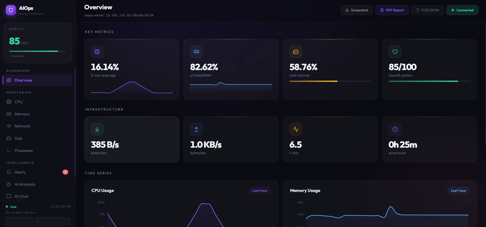
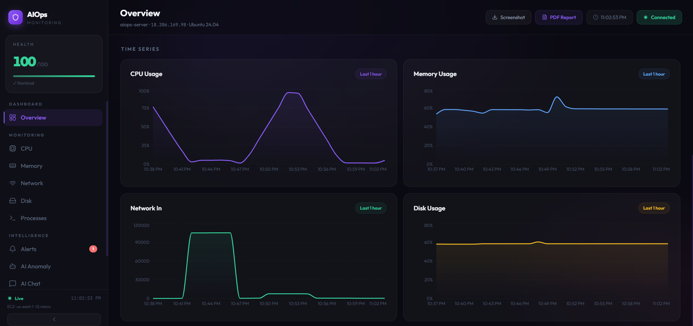
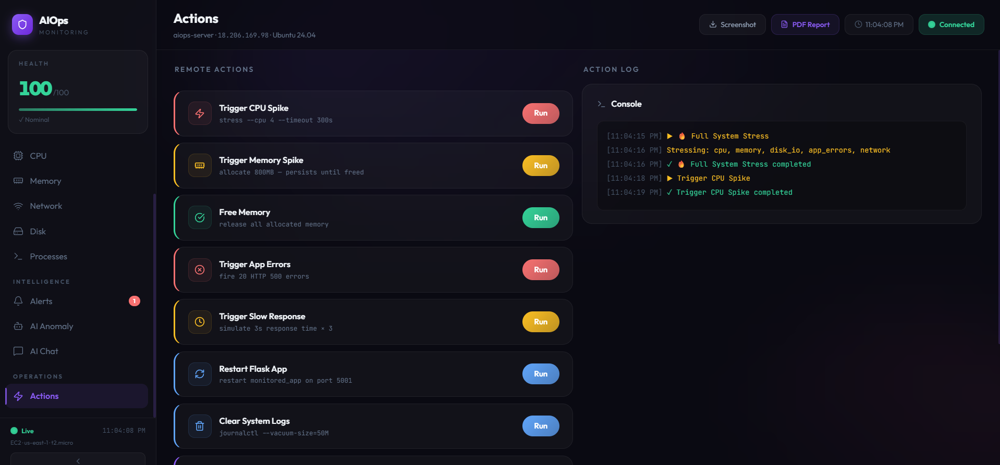
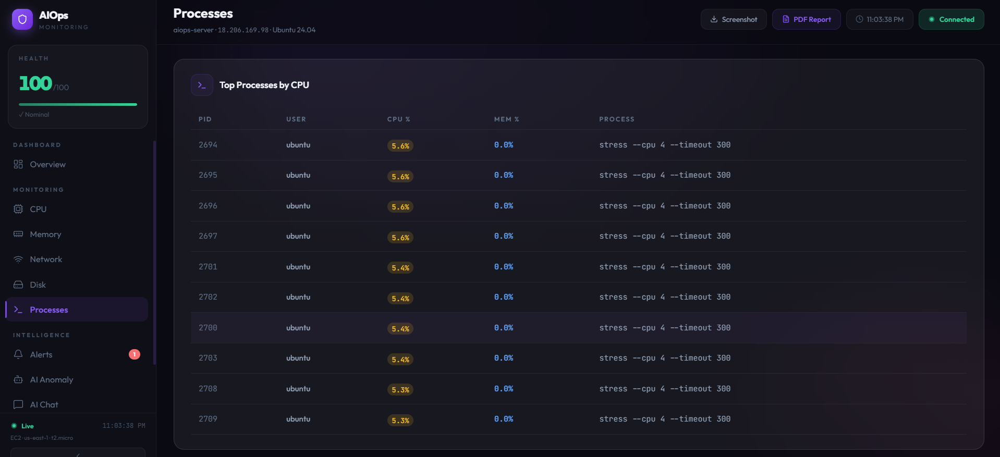
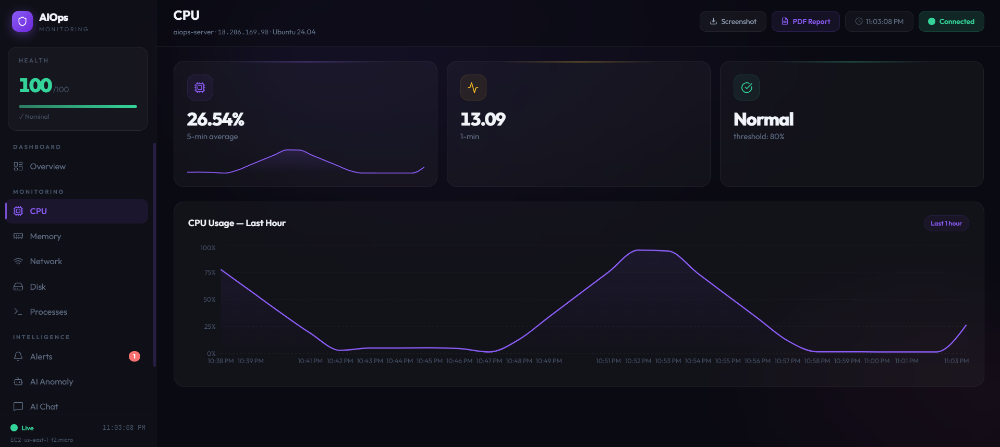
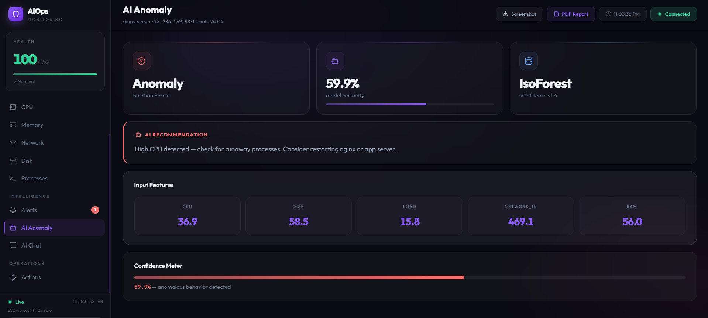
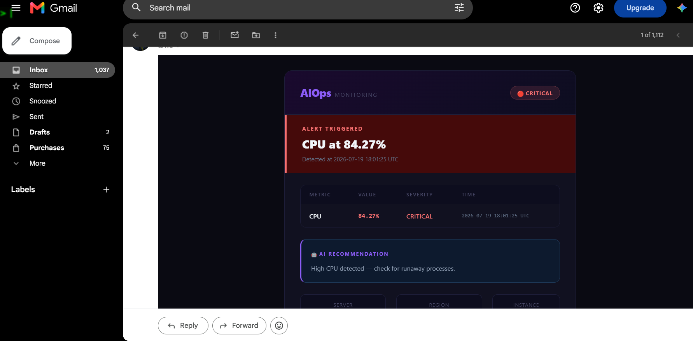
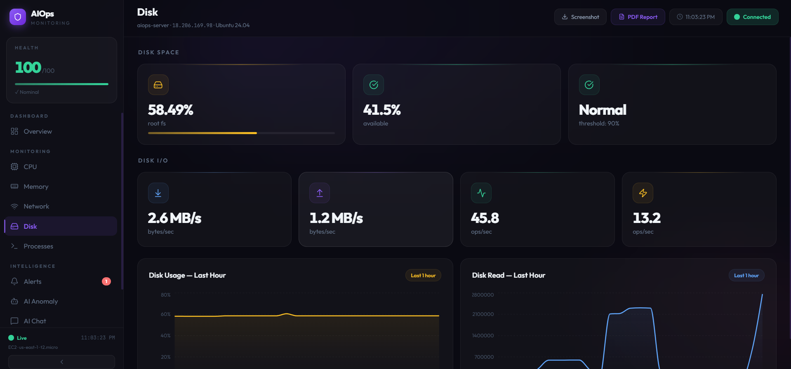
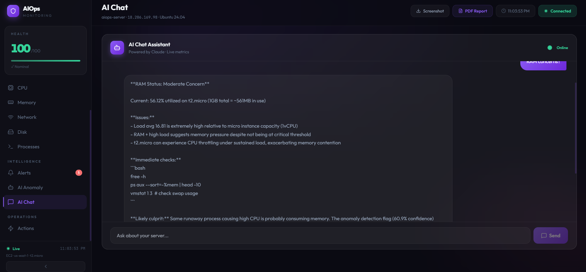

# AIOps — AI-Assisted DevOps Monitoring

A real-time infrastructure monitoring dashboard with machine-learning anomaly detection,
automated email alerting, and an AI chat assistant. Metrics are collected from a live
AWS EC2 instance, scored by an Isolation Forest model, and streamed to a React dashboard.


## Features

- **Live metrics** — CPU, memory, disk, network and load, polled from a running EC2 host
- **ML anomaly detection** — Isolation Forest trained on 10K normal + 200 anomalous samples
- **Email alerting** — Gmail SMTP notifications fired on threshold breach
- **AI chat assistant** — natural-language queries about system state, via the Claude API
- **Stress-test controls** — 11 endpoints to induce CPU load, memory spikes, errors and
  slow responses, so the detection pipeline can be demonstrated end to end
- **Historical charts** — time-series views per metric

## Stack

| Layer | Technology |
|---|---|
| Frontend | React 19, Vite 8, Tailwind CSS, Recharts |
| Backend | Python 3.12, Flask 3, Flask-CORS |
| ML | scikit-learn (Isolation Forest), pandas, numpy, joblib |
| Metrics | Prometheus + Node Exporter, psutil |
| Infra | AWS EC2 (Ubuntu 24.04), systemd |
| Alerting | Gmail SMTP |

## Screenshots

### Live overview

Health score, key metrics and infrastructure stats, polled from the EC2 host.





### Detection pipeline, end to end

A stress test is triggered from the dashboard, and the system detects and reports it
without any manual intervention.

**1. Trigger a fault.** Remote actions run real workloads on the monitored host.



**2. The load is real.** `stress --cpu 4` workers appear in the live process table.



**3. Metrics respond.** CPU climbs to 100% in the time-series view.



**4. The model flags it.** Isolation Forest scores the sample as anomalous and returns a
recommendation alongside the input features.



**5. An alert is emailed.** Threshold breaches dispatch an HTML alert via Gmail SMTP,
with a five-minute per-metric cooldown.



### Other views





## Architecture

Node Exporter exposes host metrics to Prometheus on the EC2 instance. The Flask backend
queries Prometheus via PromQL, serves the results over a REST API, and scores each sample
against a pre-trained Isolation Forest model (`anomaly_model.pkl`). The React frontend polls
that API and renders live charts. A separate monitored Flask app on port 5001 acts as the
target workload for stress tests.

## Setup

### Backend (on the EC2 host)

```bash
cd ~/aiops-backend
pip3 install -r requirements.txt
cp email_config.example.py email_config.py   # then fill in your SMTP credentials
sudo systemctl start aiops-backend
curl http://localhost:5000/api/health        # expect {"status": "ok"}
```

Runs as a systemd unit (`aiops-backend.service`) on port 5000, restarting automatically on
failure.

### Frontend (local)

```bash
cd aiops-dashboard
npm install
cp .env.example .env      # then add your Anthropic API key
npm run dev
```

Open http://localhost:5173.

> **Backend address:** the API host is set at the top of `src/App.jsx`. An EC2 instance gets
> a **new public IP every time it stops and starts**, so this needs updating after each
> restart. Assigning an Elastic IP would remove that step.

## API

| Endpoint | Purpose |
|---|---|
| `GET /api/health` | Service health check |
| `GET /api/metrics/live` | Current metric snapshot |
| `GET /api/metrics/history` | Time-series history |
| `GET /api/metrics/extended` | Extended metric set |
| `GET /api/processes` | Running process list |
| `GET /api/alerts` | Active alerts |
| `GET /api/anomaly` | Anomaly score from the ML model |
| `POST /api/action/*` | Stress-test triggers (11 endpoints) |

## Security note

The AI chat feature currently reads its API key from a `VITE_`-prefixed environment
variable. Vite inlines those into the client bundle at build time, which means the key is
readable by anyone who loads the page. Before deploying this publicly, the Claude API call
should be proxied through the Flask backend so the key stays server-side.

Secrets are excluded from this repository via `.gitignore` — `.env`, `*.pem` and
`email_config.py`. Templates are provided as `.env.example` and `email_config.example.py`.

## Repository layout

```
aiops-backend/     Flask API, ML model, training and evaluation scripts
aiops-dashboard/   React + Vite frontend
docs/              Architecture diagram, project report, reference guides
screenshots/       Dashboard screenshots
```
